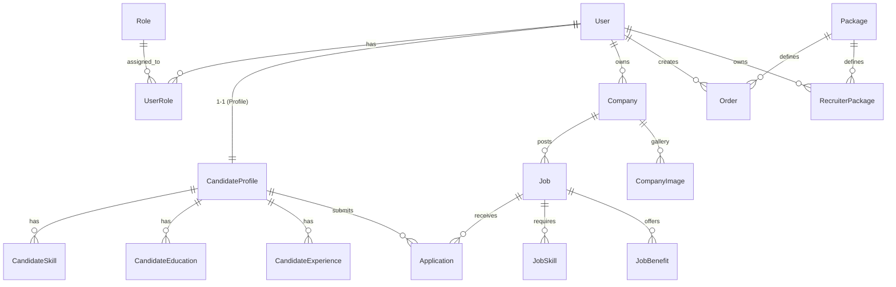

# 🚀 Job Portal Backend API

> **Mô tả:** Hệ thống Backend RESTful API hoàn chỉnh cho nền tảng tuyển dụng việc làm (Job Portal), kết nối Ứng viên (Candidate) và Nhà tuyển dụng (Recruiter). Hệ thống được xây dựng theo kiến trúc Modular, hỗ trợ phân quyền RBAC, thanh toán online VNPay, quản lý tin đăng theo gói dịch vụ và tối ưu hiệu năng với Redis Caching.


---

## 🌟 Tính năng nổi bật

### 1. Authentication & Authorization 🔐
* **JWT Authentication:** Sử dụng cơ chế Access Token (ngắn hạn) và Refresh Token (dài hạn).
* **RBAC (Role-Based Access Control):** Phân quyền chặt chẽ:
  * **Admin:** Quản trị hệ thống, duyệt hồ sơ công ty.
  * **Recruiter:** Tạo công ty, mua gói dịch vụ, đăng tin, quản lý ứng viên.
  * **Candidate:** Upload CV, tìm việc, ứng tuyển, quản lý hồ sơ.

### 2. Module Ứng Viên (Candidate) 👨‍🎓
* **CV Builder:** Quản lý hồ sơ chi tiết (Học vấn, Kinh nghiệm, Kỹ năng, Ngoại ngữ).
* **Apply Job:** Ứng tuyển, xem lịch sử và trạng thái hồ sơ.

### 3. Module Nhà Tuyển Dụng (Recruiter) 🏢
* **Company Profile:** Quản lý thông tin công ty, hình ảnh, ngành nghề.
* **Approval Flow:** Cơ chế duyệt công ty tự động/thủ công (`isApproved=true`).
* **Job Management:** Đăng tin tuyển dụng (Lương, Cấp bậc, Địa điểm, Phúc lợi...).

### 4. Kiếm tiền & Thanh toán (Monetization) 💸
* **Package System:** Quản lý các gói dịch vụ (Free Trial, Standard, Premium...).
* **Payment Gateway:** Tích hợp cổng thanh toán **VNPay**.
* **Automation:** Tự động kích hoạt gói và cộng lượt đăng tin qua IPN Webhook.

### 5. Tối ưu hiệu năng (Performance) ⚡️
* **Redis Caching:** Cache dữ liệu Master Data, Job Details để giảm tải Database.
* **Soft Delete:** Bảo toàn dữ liệu lịch sử quan trọng.
* **Interceptors:** Tự động chuẩn hóa Response (Serialization) giúp ẩn thông tin nhạy cảm.

---

## 📚 API Documentation (Swagger)

Sau khi chạy dự án, truy cập tài liệu API tương tác tại:
👉 **[http://localhost:5000/api/docs](http://localhost:5000/api/docs)**

### Tài khoản Test (Demo Accounts)

Hệ thống đã Seed sẵn các tài khoản sau để tiện kiểm thử:

| Role | Email | Password | Quyền hạn |
| :--- | :--- | :--- | :--- |
| **Admin** | `admin@jobportal.com` | `Password@123` | Quản trị toàn bộ, duyệt công ty |
| **Recruiter** | `recruiter@company.com` | `Password@123` | Đăng tin, mua gói, xem CV |
| **Candidate** | `candidate@gmail.com` | `Password@123` | Tạo hồ sơ, ứng tuyển |

---
---

## 🏗 Kiến trúc & Database

Dự án tuân thủ kiến trúc **Modular Monolith** của NestJS.

### Sơ đồ quan hệ thực thể (ERD)



---
## 🛠 Cài đặt & Chạy dự án

### 1. Yêu cầu (Prerequisites)

Trước khi cài đặt, hãy đảm bảo máy của bạn đã cài sẵn các công cụ sau:

* **Node.js**: Phiên bản v16 trở lên.
* **MySQL**: Cơ sở dữ liệu chính.
* **Redis**: Dùng để caching dữ liệu.
* **Tài khoản bên thứ 3**:

  * [Cloudinary](https://cloudinary.com/): Lưu trữ ảnh và PDF.
  * [VNPay Sandbox](https://sandbox.vnpayment.vn/): Test thanh toán.

---

### 2. Cài đặt dependencies

Mở terminal tại thư mục gốc của dự án và chạy lệnh:

```bash
npm install
```

---

### 3. Chạy dự án

Chế độ phát triển (Development Mode):

```bash
npm run start:dev
```

---

### ⚙️ Cấu hình môi trường (.env)

Tạo một file **.env** tại thư mục gốc và điền các thông tin dưới đây:

```env
# --- APP CONFIG ---
PORT=

# --- DATABASE (MySQL) ---
DB_HOST=localhost
DB_PORT=3306
DB_USERNAME=root
DB_PASSWORD=your_password
DB_NAME=job_portal_db

# --- JWT AUTHENTICATION ---
JWT_SECRET=
JWT_EXPIRATION=
JWT_REFRESH_SECRET=
JWT_REFRESH_EXPIRATION=

# --- REDIS CACHE ---
REDIS_HOST=localhost
REDIS_PORT=6379

# --- CLOUDINARY (Upload Image/PDF) ---
CLOUDINARY_CLOUD_NAME=your_cloud_name
CLOUDINARY_API_KEY=your_api_key
CLOUDINARY_API_SECRET=your_api_secret

# --- VNPAY PAYMENT (Sandbox) ---
VNP_TMN_CODE=your_tmn_code
VNP_HASH_SECRET=your_hash_secret
VNP_URL=
VNP_RETURN_URL=
```
---

### 📄 License

Dự án được phân phối theo giấy phép MIT License.
Bạn có thể sử dụng, chỉnh sửa và phân phối lại với điều kiện giữ lại thông báo bản quyền.
